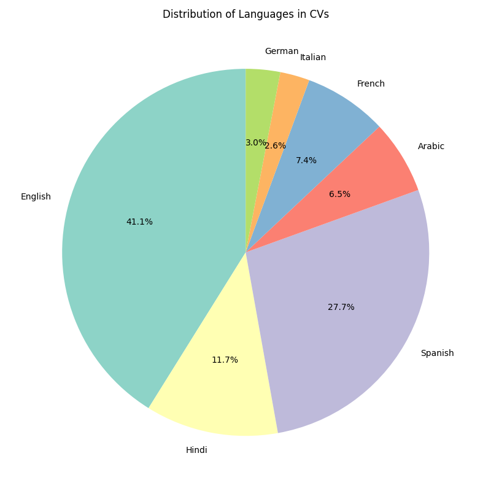
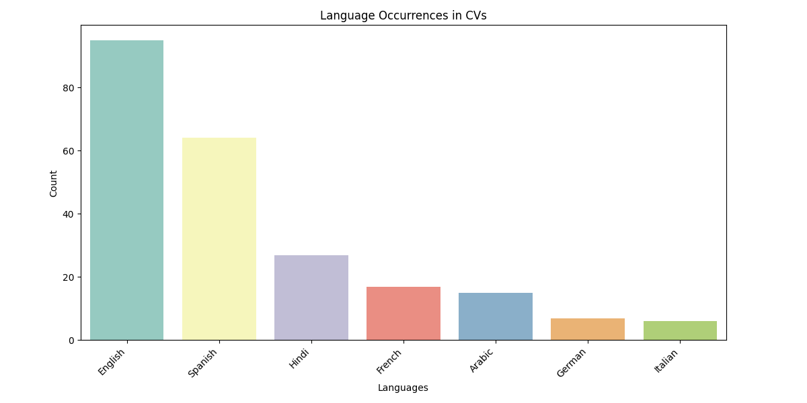

# CV Data Extraction, Analysis, and Text Classification

This project is designed to **extract, clean, analyze, and classify information from CVs** in PDF format. It combines text extraction techniques with machine learning for text classification, offering a complete pipeline from raw CVs to actionable insights.

## Table of Contents
- [Project Overview](#project-overview)
- [Features](#features)
- [Dataset](#dataset)
- [Installation](#installation)
- [Model Evaluation](#model-evaluation)
- [Data Visualization](#data-visualization)
- [Contributing](#contributing)
- [License](#license)

## Project Overview
This project has two main components:
1. **CV Data Extraction and Analysis**: Extracts and cleans information from CVs in PDF format, saving the results in CSV format for further analysis.
2. **Text Classification**: Uses machine learning to classify CV data into categories based on extracted text features.

The project leverages Python libraries like `PyMuPDF`, `pandas`, `re`, and `scikit-learn` for text processing, analysis, and classification.

---

## Features

### CV Data Extraction and Analysis
- **PDF Text Extraction**: Extracts raw text from CVs in PDF format using `PyMuPDF` (`fitz` module).
- **Text Cleaning**: Sanitizes text by removing unwanted characters, extra spaces, and formatting artifacts.
- **Information Extraction**: Extracts key sections such as:
  - **Work Experience**
  - **Education**
  - **Skills**
  - **Languages**
- **Directory Processing**: Processes CVs in bulk, including files in subdirectories.
- **Data Saving**: Stores structured data into a CSV file for further analysis.
- **Missing Value Handling**: Fills in missing data with predefined content specific to job categories.
- **Data Visualization**: Generates charts and graphs to visualize:
  - Language proficiency
  - Common skills
  - Work experience trends

### Text Classification
- **Feature Engineering**: Combines the extracted text into a single feature using TF-IDF vectorization.
- **Model Training**: Trains a **Random Forest Classifier** to classify CVs into categories.
- **Model Evaluation**: Evaluates the classifier's performance using accuracy, classification report, and confusion matrix.

---

## Dataset

### Extracted Data
The dataset is extracted from CVs in PDF format, which are located in the `cv_pdfs_collection/` directory. The structured data is saved into a CSV file (`csv_data/updated_cv_data.csv`) and contains the following fields:
- **Category**: The target category for classification.
- **Work Experience**: Extracted work experience information.
- **Education**: Extracted education details.
- **Skills**: Skills mentioned in the CV.
- **Languages**: Languages the candidate is proficient in.

---

## Installation

### Requirements
- Python 3.x
- Libraries:
  - `PyMuPDF` (`fitz`) for PDF text extraction
  - `pandas` for data manipulation
  - `re` for regex-based text processing
  - `scikit-learn` for machine learning
  - `matplotlib` and `seaborn` for data visualization
  - `numpy` for numerical operations

Install the dependencies using the following command:

```bash
pip install -r requirements.txt
```
## Model Evaluation

The classification model is evaluated using:

- **Accuracy**: The percentage of correctly classified samples.
- **Classification Report**: Precision, recall, and F1-score for each category.
- **Confusion Matrix**: A heatmap showing actual vs. predicted categories.

## Data Visualization

The extracted data can be visualized to provide insights, such as:

- **Most Common Skills**: Identify the most frequently mentioned skills across CVs.
- **Language Distribution**: Analyze the distribution of languages spoken among candidates.
- **Trends in Work Experience**: Observe patterns in work experience categorized by industry or role.





## Contributing

We welcome contributions! Feel free to:

1. **Fork the Repository**: Create a copy of this repository under your own GitHub account.
2. **Create a Feature Branch**: Make changes or add new features in a separate branch.
3. **Submit a Pull Request**: Propose your changes to be merged into the main repository.

Your contributions help make this project better!

## License

This project is licensed under the [MIT License](LICENSE). See the LICENSE file for more details.

